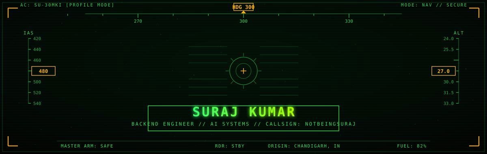
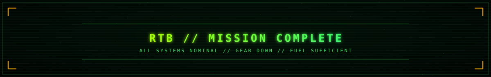

<div align="center">



</div>

<br/>

## `LOG_ENTRY_01 :: TRANSMISSION`


> Third-year CSE student, operating at the intersection of backend
> engineering and AI systems. Not chasing the happy path — the
> failure path is where a system tells the truth about itself.

```
  IDEA ─▶ ARCHITECTURE ─▶ BUILD ─▶ TEST ─▶ BREAK ─▶ DEBUG ─▶ SHIP
```

<br/>

## `LOG_ENTRY_02 :: PAYLOAD MANIFEST`


| SECTOR | COMPONENTS |
|:--|:--|
| **CORE LANG** | JavaScript · TypeScript · Python · Java · C++ · SQL |
| **BACKEND** | Node.js · Express · REST APIs · MongoDB |
| **AI / LLM** | LLM Integration · Prompt Engineering · Structured Output · Validation & Fallback Handling |
| **SYSTEMS** | System Design · Automation · Testing · Debugging |

<br/>

## `LOG_ENTRY_03 :: ACTIVE MISSIONS`


```
┌──────────────┬──────────────────────────────────────────────┬──────────┐
│ MISSION      │ OBJECTIVE                                     │ PAYLOAD  │
├──────────────┼──────────────────────────────────────────────┼──────────┤
│ Webloom    │ raw business data → validated website spec    │ JS/Node  │
│              │ via AI pipeline w/ modular services            │ MongoDB  │
├──────────────┼──────────────────────────────────────────────┼──────────┤
│ CAR-E-FREE   │ real-time car rental system, offer engine      │ JS       │
├──────────────┼──────────────────────────────────────────────┼──────────┤
│ MONETRA      │ tracks loans between users, trust scoring      │ Dart     │
├──────────────┼──────────────────────────────────────────────┼──────────┤
│ FABLES-FLOW  │ systems work — The Fables Lab                  │ TS       │
├──────────────┼──────────────────────────────────────────────┼──────────┤
│ FABLES-LAB   │ full site revamp — The Fables Lab               │ TS       │
└──────────────┴──────────────────────────────────────────────┴──────────┘
```

**→** [Webloom](https://github.com/notbeingsuraj/Webloom) · [CAR-e-Free](https://github.com/notbeingsuraj/CAR-e-Free) · [Monetra](https://github.com/notbeingsuraj/Monetra) · [fables-flow](https://github.com/notbeingsuraj/fables-flow) · [Fables-Lab-V1](https://github.com/notbeingsuraj/The-Fables-Lab-V1)

<br/>

## `LOG_ENTRY_04 :: FLIGHT RULES`


```
01. DESIGN BEFORE CODING          05. NEVER TRUST RAW AI OUTPUT
02. VALIDATE EVERY ASSUMPTION     06. TEST THE EDGES, NOT THE MIDDLE
03. EXPECT FAILURE                07. DEBUG ROOT CAUSE, NOT SYMPTOM
04. KEEP SERVICES BOUNDED         08. SHIP WHAT ACTUALLY WORKS
```

<br/>

<div align="center">



**[github.com/notbeingsuraj](https://github.com/notbeingsuraj)**  ·  [LinkedIn](https://linkedin.com/in/surajprocode)  ·  [X](https://x.com/notbeingsuraj)  ·  [Instagram](https://instagram.com/surajupadhyayx)  ·  [thefableslab.com](https://www.thefableslab.com)

</div>
